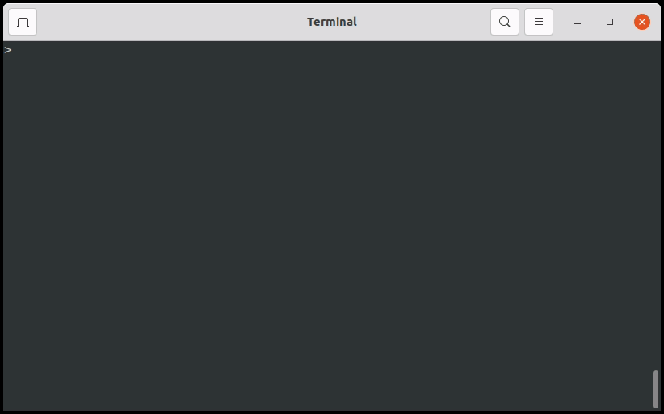

Indic transliteration tools
=======================
[](https://travis-ci.org/indic-transliteration/indic_transliteration_py)
[](http://indic-transliteration.readthedocs.io/en/latest/?badge=latest)
[](https://github.com/indic-transliteration/indic_transliteration_py/actions)
[](https://badge.fury.io/py/indic_transliteration)


# For users
* [Autogenerated Docs on readthedocs (might be broken)](http://indic-transliteration.readthedocs.io/en/latest/).
* Manually and periodically generated docs [here](https://indic-transliteration.github.io/indic_transliteration_py/build/html/)
* For detailed examples and help, please see individual module files in this package.

## Installation or upgrade:
* `sudo pip install indic_transliteration -U`
* `sudo pip install git+https://github.com/indic-transliteration/indic_transliteration_py/@master -U`
* [Web](https://pypi.python.org/pypi/indic-transliteration).


## Usage

```py
In [1]: from indic_transliteration import sanscript
   ...: from indic_transliteration.sanscript import SchemeMap, SCHEMES, transliterate
   ...:

In [2]: data = 'idam adbhutam'

In [3]: print(transliterate(data, sanscript.HK, sanscript.TELUGU))
ఇదమ్ అద్భుతమ్

In [4]: print(transliterate(data, sanscript.ITRANS, sanscript.DEVANAGARI))
इदम् अद्भुतम्

In [5]: scheme_map = SchemeMap(SCHEMES[sanscript.VELTHUIS], SCHEMES[sanscript.TELUGU])

In [6]: print(transliterate(data, scheme_map=scheme_map))
ఇదమ్ అద్భుతమ్
```

For a full list of supported schemes, please see files under [indic_transliteration/sanscript/schemes/data](/tree/master/indic_transliteration/sanscript/schemes/data) .

### Lazy anusvaara-s
```
    assert sanscript.SCHEMES[sanscript.ITRANS].fix_lazy_anusvaara("shaMkara") == "sha~Nkara"
    assert sanscript.SCHEMES[sanscript.ITRANS].fix_lazy_anusvaara("saMchara") == "sa~nchara"
    assert sanscript.SCHEMES[sanscript.ITRANS].fix_lazy_anusvaara("saMvara") == "sav.Nvara"
    assert sanscript.SCHEMES[sanscript.ITRANS].fix_lazy_anusvaara("saMyukta") == "say.Nyukta"
    assert sanscript.SCHEMES[sanscript.ITRANS].fix_lazy_anusvaara("saMlagna") == "sal.Nlagna"
```

### Lazy visarga-s
```
    assert sanscript.SCHEMES[sanscript.DEVANAGARI].fix_lazy_visarga("अन्तः पश्य") == "अन्तᳶ पश्य"
    assert sanscript.SCHEMES[sanscript.DEVANAGARI].fix_lazy_visarga("अन्तः कुरु") == "अन्तᳵ कुरु"
```

### Lay Indian search terms
```
    assert sanscript.SCHEMES[sanscript.OPTITRANS].to_lay_indian("taM jitvA") == "tam jitva"
    assert sanscript.SCHEMES[sanscript.OPTITRANS].to_lay_indian("kRShNa") == "krishna"
```

## Dravidian language extension
```py
In [1]: from indic_transliteration import xsanscript
   ...: from indic_transliteration.xsanscript import SchemeMap, SCHEMES, transliterate
   ...:

In [2]: data = 'असय औषधिः ग्रन्थः। ऎ ऒ यॆक्ककॊ?'

In [3]: print(transliterate(data, xsanscript.DEVANAGARI, xsanscript.KANNADA))
ಅಸಯ ಔಷಧಿಃ ಗ್ರನ್ಥಃ। ಎ ಒ ಯೆಕ್ಕಕೊ?
```


## Font converters
```
    converter = tech_hindi.DVTTVedicConverter()
    text_in = "    +<=hÉ *1* +EòÉ®úÉä Ê´É´ÉÞiÉ ={ÉÊnù¹]õ& |ÉÉÊGòªÉÉnù¶ÉɪÉÉÆ SÉäiªÉjÉ \"+ +' (ºÉÚ.8-4-68)  "
    output = converter.convert(text_in)
```

## CLI

Installing the package with `pip` also installs a console script, `sanscript` which can used to transliterate files, standard input or input strings from the command-line.

### Demo

<p align="center">
  
</p>

### Usage

**Note**: Refer `sanscript --help` for the latest information.

```console
$ sanscript [OPTIONS] [INPUT_STRING]
```

**Arguments**:

- `[INPUT_STRING]`:  
  Input string to transliterate from the given '--from' scheme to the given '--to' scheme.  
  **Note:** This input will be ignored if '--input-file' option is specified.

**Options**:

- `-f, --from TEXT`: [required]  
  Name of the scheme FROM which the input is to be transliterated.  
  **Note**: Use `--help` to see the list of valid scheme names.

- `-t, --to TEXT`: [required]  
  Name of the scheme TO which the input is to be transliterated.  
  **Note**: Use `--help` to see the list of valid scheme names.

- `-i, --input-file FILENAME`:  
  Input file path to transliterate.  
  **Note**: When this option is used, input from the `INPUT_STRING` argument will be ignored.

- `-o, --output-file FILENAME`:  
  Output file path to write transliterated output.  
  **Note**: If it is not specified or its argument is '-', the output is written to Standard Output.

**Enabling auto-completion**:

- `--install-completion`: Install completion for the current shell.
- `--show-completion`: Show completion for the current shell, to copy it or customize the installation.

**Help**:

- `--help`: Show usage information and other details.

### Examples

#### Input options

- Read input from command's argument.

  **Example**:

  ```console
  $ sanscript --from hk --to iast "rAmAyaNa"
  ```

  **Output**: `rāmāyaṇa`

- Read from input file. File path is passed to `--input-file` / `-i` option.

  **Example**:

  ```console
  $ sanscript --from hk --to iast -i ramayana.txt
  ```

  **Output**: `rāmāyaṇa`

- Read from Standard Input `-`.

  **Example**: (Using pipe)

  ```console
  $ cat ramayana.txt | sanscript --from hk --to iast -i -
  ```

  OR: (Using input redirection)

  ```console
  $ sanscript --from hk --to iast -i - < ramayana.txt
  ```

  **Output**: `rāmāyaṇa`

#### Output options

- To Standard Output

  Example:

  ```console
  $ sanscript --from hk --to iast "rAmAyaNa"
  ```

  OR:

  ```console
  $ sanscript --from hk --to iast "rAmAyaNa" -o -
  ```

  Output: `rāmāyaṇa`

- To file passed to '--ouput-file / -o' option

  Example:

  ```console
  $ sanscript --from hk --to iast "rAmAyaNa" -o output.txt
  ```

  Output: `Output written to: /home/user/output.txt`

# For contributors

## Contact

Have a problem or question? Please head to [github](https://github.com/indic-transliteration/indic_transliteration_py).

## Packaging

* ~/.pypirc should have your pypi login credentials.
```
python setup.py bdist_wheel
twine upload dist/* --skip-existing
```

## Build documentation
- sphinx html docs can be generated with `cd docs; make html`

## Testing
Run `pytest` in the root directory.

## Auxiliary tools
- [](https://travis-ci.org/indic-transliteration/indic_transliteration_py)
- [](http://indic-transliteration.readthedocs.io/en/latest/?badge=latest)
- [pyup](https://pyup.io/account/repos/github/indic-transliteration/indic_transliteration_py/)